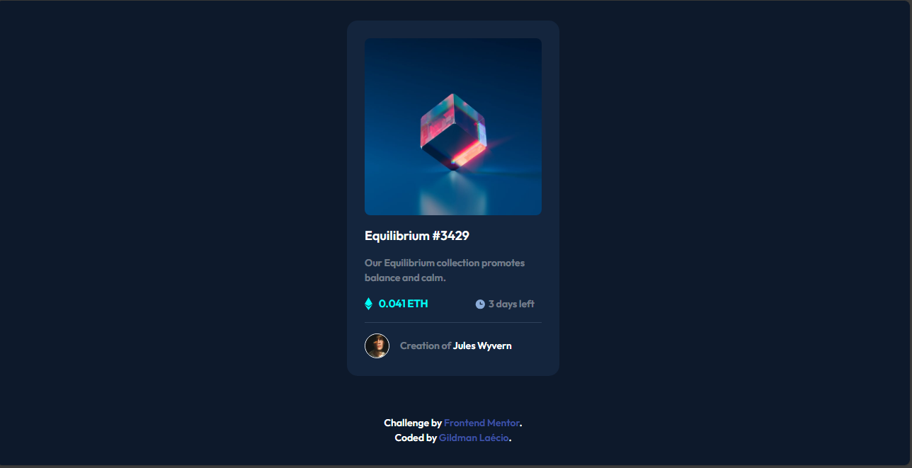

# nft-preview-card-component-main
 nft-preview-card-component-main

This is a solution to the [NFT-preview-card-component-main challenge on Frontend Mentor](https://www.frontendmentor.io/challenges/nft-preview-card-component-SbdUL_w0U). Frontend Mentor challenges help you improve your coding skills by building realistic projects. 

## Table of contents

- [Overview](#overview)
  - [Screenshot](#screenshot)
  - [Links](#links)
- [My process](#my-process)
  - [Built with](#built-with)
  - [What I learned](#what-i-learned)
  - [Continued development](#continued-development)
- [Author](#author)

## Overview

### Screenshot

These are my screenshots showing how the project turned out.

- For desktop version:



- For mobile version:


- For active-state:


### Links

- Solution URL: [My Solution](https://gillaercio.github.io/four-card-feature-section-master/)

## My process

### Built with

- Semantic HTML5 markup
- CSS custom properties
- Grid Layout
- Mobile-first workflow

### What I learned

I learned a little more about the effect on images:

```css
.feature-img {
  background-image: url(/assets/images/image-equilibrium.jpg);
  background-size: cover;
  width: 250px;
  height: 250px;
  border-radius: 8px;
}

.filter {
  width: 100%;
  height: 100%;
  background-color: var(--cyan);
  display: none;
  transition: background-color .5s;
}

.feature-img:hover .filter {
  opacity: .4;
  display: block;
  border-radius: 8px;
  cursor: pointer;
}
```

### Continued development

I would like to improve even more.

## Author

- Frontend Mentor - [@gillaercio](https://www.frontendmentor.io/profile/gillaercio)
- Github - [My Github](https://github.com/gillaercio)
- LinkedIn - [My LinkedIn](https://www.linkedin.com/in/gildman-la%C3%A9rcio/)